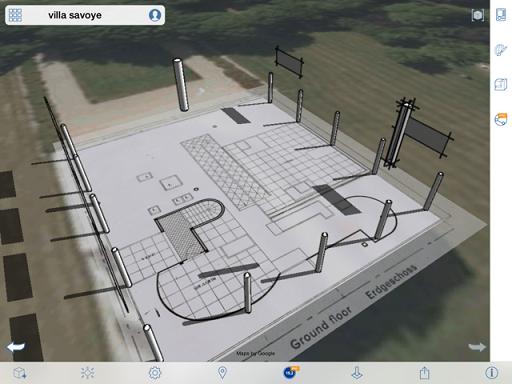

# 地面オーバーレイ イメージを読み込み、修正する

---

設計キャンバスのイメージを取得し、必要に応じて変更します。

## 地面オーバーレイ イメージを読み込む

1. イメージを読み込むには、下部にあるツールバーの[読み込み]ボタンを選択し、イメージをタップします。
2. 写真へのアクセスを選択して許可し、カメラ ロールを選択します。

1. カメラ ロールまたはフォト ストリームからイメージを選択します。

イメージが自動的にキャンバスに読み込まれます。

## 地面オーバーレイ イメージを修正する

1. 画面の右側にあるパレットを使用して、イメージのプロパティを修正します。
2. パレットではイメージの名前と透過度を編集できます。
3. [縦方向に表示]パネルを使用してドラッグ アンド ドロップし、読み込んだ衛星画像を含め、すべての地面オーバーレイ イメージの配置(順序)を編成します。

