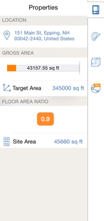

# 建物パフォーマンス

---

BIM ワークフローでは、最初に、設計プロセスの初期段階から各種要素のパフォーマンスを評価します。

### 建物パフォーマンス

| | |
| ---- | ---- |
|プロパティは、選択したオブジェクトに関する情報を提供します。変更を加えると、その値が更新されます。建物のパフォーマンスを判別するには、日照とエネルギーの解析機能(Pro のみ)を使用します。||

#### 参照

* オブジェクトのプロパティを調べる
* [レベルと容積](../../Levels and Space Usage.md)

#### このセクションの内容

* [太陽と影の設定 ](../Sun and Shadow Settings.md)

日付と時刻を設定することにより、現在位置における影の角度をコントロールします。

* [日照解析](../Solar Analysis.md)

モデルの日照量を視覚化します。

* [建物全体のエネルギー解析](../Whole Building Energy Analysis.md)

壁の断熱、HVAC 効率など、建物パフォーマンスに影響を及ぼす要素を評価します。

