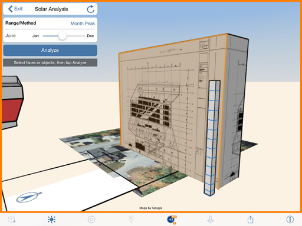
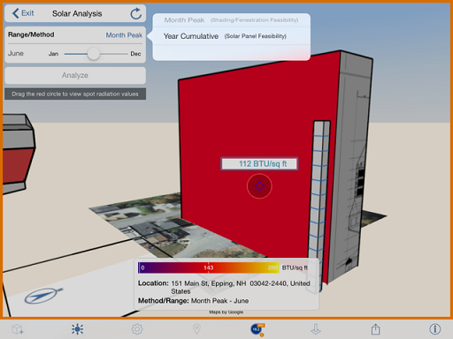

# 日照解析

---

モデルの日照量を視覚化します。

Autodesk FormIt Pro のみ

1. [太陽と影]アイコンをタップして、[日照解析]をタップします。

2. オブジェクトまたは面を選択します。

3. [解析]をクリックします。
4. [日照解析]グラフを確認します。

5.  をタップすると、[月のピーク]と[累積年]を切り替えることができます。

[月のピーク]に切り替えると、月別のピーク時の日射量(BTU/sq ft または Wh/sq m)が表示され、[累積年]に切り替えると、合計日射量(kw/Sq m)が表示されます。[月のピーク]は、建物ファサードのシェーディング方法を決定するときに役立ちます。[累積年]は、太陽電池の導入を検討するときに役立ちます。

6. スライダを動かすと、時期が変わります。

7. [終了]をタップして終了します。

