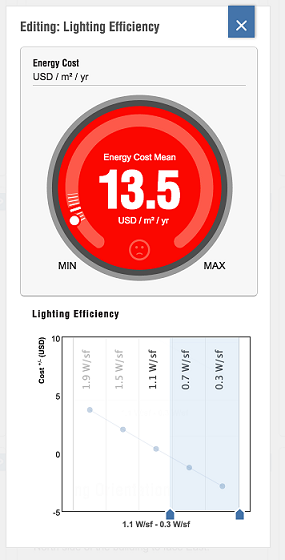

# 建物全体のエネルギー解析

---

壁の断熱、HVAC 効率など、建物パフォーマンスに影響を及ぼす要素を評価します。

Autodesk Formit 360 Pro のみ

FormIt 360 Pro のエネルギー解析機能を使用すると、多くの要因に基づいて設計のパフォーマンスがどのように変化するかを明確に把握できます。この機能を使用するには、まずプロジェクトの位置を設定し、少なくとも 1 つのソリッド オブジェクトにレベルを適用する必要があります。[エネルギー解析]ボタン  をタップすると、[エネルギー解析]ダッシュボードが開きます。

ユーザ独自のモデルを解析する前に、[建物フォーム]ウィジェットを開いて、以前にモデル化した 13 個のフォームを確認することができます。プロジェクトの現在の位置でこれらのフォームがどのようなパフォーマンスを発揮するかを確認するには、フォームをタップした後で、[X]をタップしてこのウィンドウを閉じます。

[エネルギー解析]ダッシュボードに、多数の要因ウィジェットが表示されます。

要因ウィジェットを開くと、要因を変化させて、それがエネルギー コストの平均値にどのように影響するかを確認することができます。

