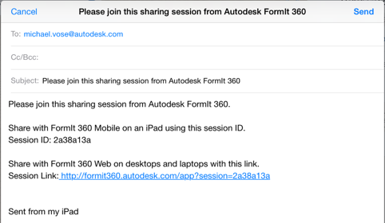

# セッションに参加する

---

コラボレーションに参加します。

* [Autodesk 360](https://360.autodesk.com) にログインします。
* セッションのホストから提供されたリンクをタップするか、リンクの URL を Web ブラウザのアドレスバーに貼り付けます。

* セッション ID をコピーして、[コラボレーションに参加]ボックスに貼り付けます。

これにより、共有メンバーとして追加され、自分のアイコンがツールバーに表示されます。共有メンバーの名前の横にある赤いカメラ アイコンをタップして、そのユーザのセッション カメラに従います。

* コラボレーションが完了したら、[セッションの共有を終了]をタップします。

ゲストの共有ユーザとしてセッションを終了すると、スケッチのコピーが A360 アカウントに保存されないことに注意してください。

