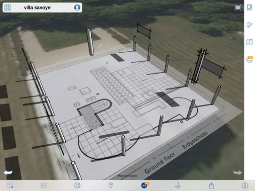

# 3D モデルとイメージを読み込む

---

さまざまな目的に応じてオーバーレイやイメージを設計に追加します。

地面オーバーレイを使用して、スケッチに追加情報を追加したり、トレース用の配置図を指定することができます。

1. ローカルまたは A360 の記憶領域からイメージまたは 3D モデルを選択します。

イメージは拡大/縮小およびトリミングできます。その後、イメージをキャンバスに読み込みます。

1. 画面の右側にあるパレットを使用して、イメージのプロパティを修正します。

必要に応じて、イメージの名前と透過度を編集します。衛星画像を含め、さまざまな地面オーバーレイの縦方向の表示を管理します。

