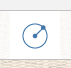

# 形状をスケッチする

---

線分、円弧、スプライン、長方形、円を使用して、建物設計に組み入れる形状を作成します。

描画ツールを選択した後、キャンバス上の任意の場所にカーソルを合わせると、スナップと推定配置点が表示されるため、それらを基準に最初の点を配置できます。

## 線分を使用する

1. 線分ツールを選択した後、キャンバス上の任意の場所をタップしてドラッグすると、スナップと推定配置点が表示されます。線分の最初の端点を配置する位置で指を離します。次の線分セグメントを描画するには、最後の端点からドラッグする必要があります。
## 円弧を使用する

1. 円弧ツールを選択した後、キャンバス上の任意の場所をタップしてドラッグすると、スナップと推定配置点が表示されます。円弧の最初の端点を配置する位置で指を離します。円弧のもう 1 つの端点を描画するには、最後の端点からドラッグする必要があります。最後に中点をグラブして、円弧の角度を調整します。 
## スプラインを使用する

1. スプライン ツールを選択した後、キャンバス上の任意の場所をタップしてドラッグすると、スナップと推定配置点が表示されます。スプラインの最初の端点を配置する位置で指を離します。次の端点を描画するには、最後の端点からドラッグする必要があります。 
## 長方形を使用する

1. 長方形ツールを選択した後、キャンバス上の任意の場所をタップしてドラッグすると、スナップと推定配置点が表示されます。長方形の最初の端点を配置する位置で指を離します。長方形の辺を描画するには、最後の端点からドラッグする必要があります。
## 円を使用する

1. 円ツールを選択した後、キャンバス上の任意の場所をタップしてドラッグすると、スナップと推定配置点が表示されます。円の中心点を配置する位置で指を離します。円の半径を指定するには、中心点からドラッグする必要があります。 

