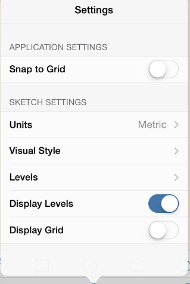

# レベルとスペースの用途

---

設計内のオブジェクトの面積計算を表示します。

## レベルを有効にする

1. 下部にあるツールバーで[設定]アイコンをタップします。
2. [レベル]を選択して、各レベルの高さを指定します。

3. スケッチ内の各オブジェクトに適用するレベルを指定します。

[+] (プラス)記号または二重の[++]記号を使用して、値を追加します。

## プロパティとスペースの用途

スケッチで選択した個々のオブジェクトのプロパティを表示または編集するには、[プロパティ]タブの右側にあるパレットを開きます。[プロパティ]では、オブジェクトの名前を編集したり、その体積や面積を表示したり、レベルを切り替え、編集することができます。

* ジオメトリを追加すると、スケッチ全体で[総面積]と[床面積率]が自動的に更新されます。この機能をアクティブにして、これらの数値に個別の要素を追加するには、各オブジェクトで[レベル別の領域]をオンにする必要があります。

