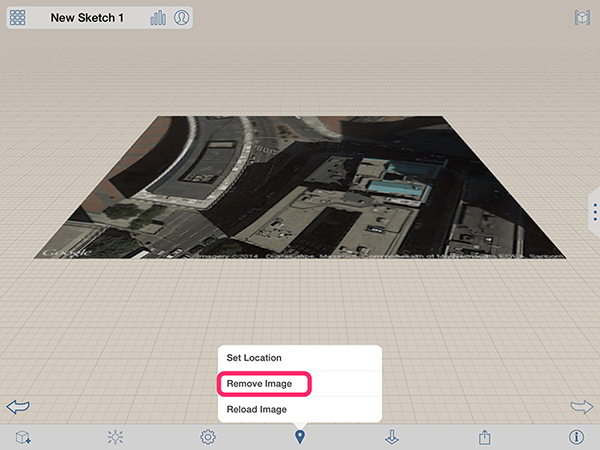
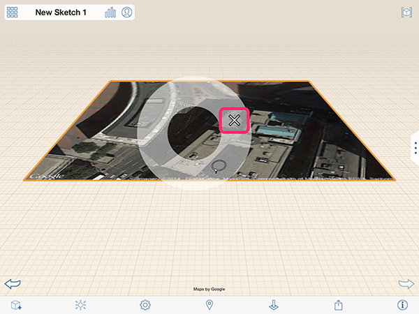

# 衛星画像を編集、再ロード、または削除する

---

位置のイメージを変更します。

## 衛星画像を使用して作業する

1. 衛星画像を再ロードするには、アクション ツールバー  から位置アイコンを選択し、[イメージを再ロード]を選択します。 
2. 衛星画像を削除するには:
* アクション バーから選択: 下部のツールバーから位置アイコンを選択し、[イメージを削除]オプションを選択します。
* コンテキスト メニューから選択: 衛星画像をダブルタップして選択します。その後、衛星画像を長押しすると、コンテキスト メニューが表示されます。 
* [削除]アイコンを選択します。

3. 他のイメージと同様、衛星画像の名前、透過度、縦方向を編集できます。

