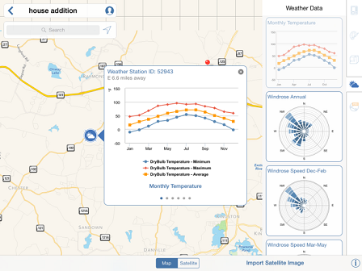

# 衛星画像を読み込む

---

詳細を追加して設計に現実感を加えます。

衛星画像や気象ステーションのデータは設計に重要な情報を追加します。

#### 衛星画像を読み込む

1. 左上の[位置]記号の下にある検索ボックスに特定の場所を入力するか、マップ ビューを画面移動またはズームして位置を設定します。
2. 目的の位置が見つかったら、長押しして赤いピンを配置します。
3. [衛星画像を読み込む]をタップして、航空写真をスケッチに追加します。
4. 表示されるダイアログを使用して衛星画像のサイズを調整し、スケッチに関連するコンテキストを表示します。
5. [読み込みを終了]をタップします。
#### 気象ステーション

1. 選択した位置に近い[気象ステーション]アイコンをタップします。

2. その位置の温度と風の方向をグラフ形式で示した履歴情報が表示されます。この情報は、建物の方向に関する意思決定を通知したり、そのプロジェクト特有の気候を集計するのに役立ちます。

3. 右上隅にある[X]をタップして、表示されている気象ステーションを閉じます。

