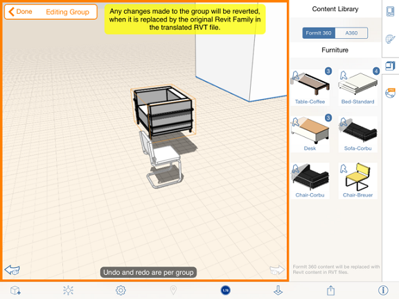

# コンテンツ ライブラリ

---

家具、建物要素、マテリアルの基本ファイルなど、頻繁に使用する要素を個人的なライブラリにまとめておくことができます。

以前のプロジェクトや外構ファイルを保存できます。コンテンツ ライブラリを保存しておくと、ローカル フォルダ(Dropbox 同期フォルダなど)や [Autodesk 360 ドライブ](https://360.autodesk.com)からリンクできます。 コンテンツ ライブラリを使用するには、キャンバスの右側にある[プロパティ]パネルで[コンテンツ ライブラリ]アイコンをタップします。

新しい FormIt スケッチ(.AXM)、.OBJ、または .STL ファイルをコンテンツ ファイル構造のローカルまたは A360 ドライブに追加した後、FormIt でコンテンツ ライブラリを再表示する必要があります。再表示するには、[ライブラリにリンク]ボタンを再度クリックし、ローカル ライブラリにナビゲートするか、または A360 のオプションを選択します。これにより、リストが自動的に再表示されます。

ライブラリにローカルでリンクした後、新しい FormIt セッションを開始する場合は、コンテンツ ライブラリのリンクを設定し直す必要があります。[コンテンツ ライブラリ]タブをクリックすると、ダイアログが表示され、ローカル フォルダへのリンクを許可するか確認を求められます。コンテンツ ライブラリ フォルダの最上位レベルにナビゲートする必要があります。

スケッチに追加されるコンテンツはグループです。コンテンツを変更するには、グループ編集ツールを使用します。

グループ編集モードでは、ユーザに向けてコンテンツの名前とカテゴリが表示されます。Revit ファミリ(ローカルまたは A360)から変換されたコンテンツの名前またはカテゴリを編集することはできません。

配置されたコンテンツのジオメトリを編集することはできますが、その変更を Revit に移行し直すことはできません。

#### このセクションの内容

* [コンテンツ ライブラリにリンクする](../Link a Content Library.md)

以前に保存したプロジェクトおよび外構ファイルにアクセスします。

* [コンテンツを配置する](../Place Content.md)

設計でコンテンツ ライブラリ ファイルのデータを使用します。

