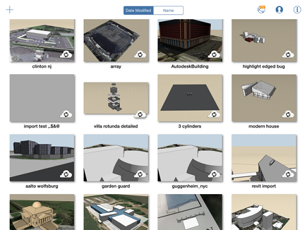

# 作業内容を保存する

---

さまざまな形式で設計を保存します。

* すべてのスケッチに、デバイスのギャラリーまたは [http://360.autodesk.com](http://360.autodesk.com) からアクセスできます。 ソフトウェアを終了するたびに、それまで作業していたスケッチが自動的に保存されます。ギャラリーに戻るたびに、スケッチを保存するように促されます。ファイルをクラウドと同期するには、[http://360.autodesk.com](http://360.autodesk.com) にサインインします。

スケッチが [http://360.autodesk.com](http://360.autodesk.com) と同期されると、AXM、SAT、および RVT の 3 つの形式のファイルが作成されます。RVT 形式のファイルは、Revit ベースの製品で開くことができます。  Revit ファイルはローカルでダウンロードでき、Revit で直接開くことができます。

