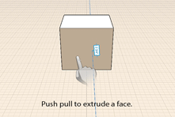

# 修正: 面を押し出す、切り取る、オフセットする

---

面のプッシュとプル、既存の形状に対する新しい形状のインプリント、既存のエッジから新しいエッジへのオフセットの作成について説明します。

1. 面をプッシュおよびプルするには、面をタップし、1 本指または 2 本指でドラッグします。 1 本指でドラッグすると面が押し出され、2 本指でドラッグすると元のエッジを保持しながら面が押し出されます。面が前後に移動するため、他のモデル要素上のスナップおよび推定配置点までドラッグできます。もう一度タップすると、面の移動が完了します。
2. 形状をインプリントするには、3D スケッチ ツールを使用して、直線、円弧、スプライン、長方形、または円を既存の面上に描画します。 この操作により、元の面からは独立してプッシュやプルを行うことができる新しい面が作成されます。
3. 面をオフセットするには、対象となる面を選択し、コンテキスト メニューのオフセット ツールをタップします。 次に、面上をドラッグして、元のエッジからオフセットされた一連のエッジを作成します。

