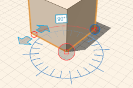

# 修正: 拡大/縮小および回転する

---

オブジェクトのサイズと向きを調整します。

1. エッジ、面、またはオブジェクトを拡大/縮小するには、最初にそのいずれかを選択し、長押ししてコンテキスト メニューを表示し、[スケール]アイコンを選択します。 ピンチのジェスチャでジオメトリを拡大または縮小します。
2. エッジ、面、およびオブジェクトを回転するには、そのいずれかを選択し、長押しして、コンテキスト メニューから回転ツールを選択します。 回転軸をタップして指定します。矢印をドラッグして、回転角度の開始位置と終了位置を指定します。

