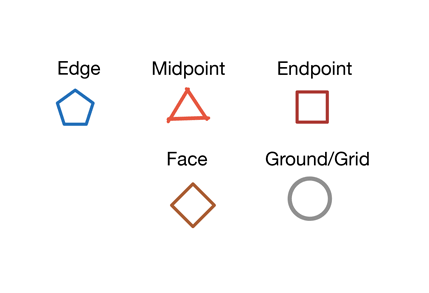
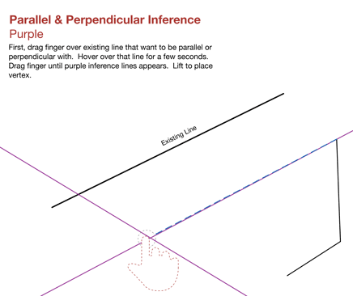

# スナップと推定配置点

---

これらの組み込み機能を使用して、より正確な設計を作成します。

* スナップと推定配置点を使用すると、スケッチとモデリングを簡単に実行できるだけでなく、ジオメトリの作成、配置、編集も正確に行うことができます。描画を行う軸として、任意の軸を選択して使用することができます。この軸で、サーフェスの押し出しなどの操作を実行することもできます。

*スナップする*

スケッチやモデリングを行う際に、いくつかのスナップを使用することができます。オブジェクトへのスナップは、自動的に有効になります。次に示すスナップ先にスナップすることができます。

* エッジ
* 中心点
* 頂点上の端点
* 面上
* 面の中心
* 地盤面

グリッドにスナップするには、[設定]メニューの[グリッドにスナップ]をオンにする必要があります。

*推定配置点*

推定配置点の選択機能は常に有効になっているため、ジオメトリの動作を制限することができます。

* X 軸、Y 軸、Z 軸に沿ってジオメトリを移動することができます。X 軸の推定配置点は赤、Y 軸の推定配置点は緑、Z 軸の推定配置点は青で表示されます。

* 既存の要素に対して平行または垂直に、ジオメトリのスケッチや移動を行うこともできます。平行方向および垂直方向の推定配置点は紫色で表示されます。

* 任意の点からの延長: 推定配置点を使用して、任意の点参照から延長することができます。

任意の点からの延長: 推定配置点を使用して、任意の点参照から延長することができます。参照情報として使用する点にマウス カーソルを置いてツールチップを表示し、その点から伸びる推定軸を使用します。

