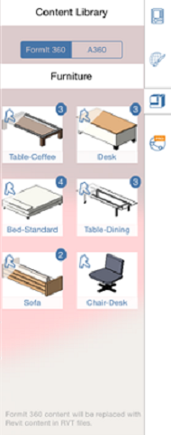

# コンテキスト メニューとパレット

---

設計を作成して配置するためのツールを見つけます。

ユーザ インタフェースには、特定のプラットフォームの標準的な操作モデルが採用されています。

## コンテキスト メニュー

* コンテキスト メニューを表示するには、オブジェクトまたは空のスペースを長押しします。選択内容に応じて異なるツールがコンテキスト メニューに表示されます。これらのツールを使用して選択内容を編集できます。

### オブジェクト/マテリアル パレット

* オブジェクト/マテリアル パレットを表示するには、パレット ハンドルをタップするか、画面端からスワイプします。[オブジェクトのプロパティ]タブでは、オブジェクト名の管理、レベル設定の定義、および面積と容積に関するフィードバックの受信が可能です。

* また、[マテリアル]タブでは、マテリアルを作成、編集し、オブジェクトに適用することができます。

* ローカル コンピュータまたは A360 ドライブからライブラリをリンクするには、[コンテンツ ライブラリ]を使用します。ライブラリから FormIt 360 スケッチにコンテンツをドラッグ アンド ドロップできるようになります。

