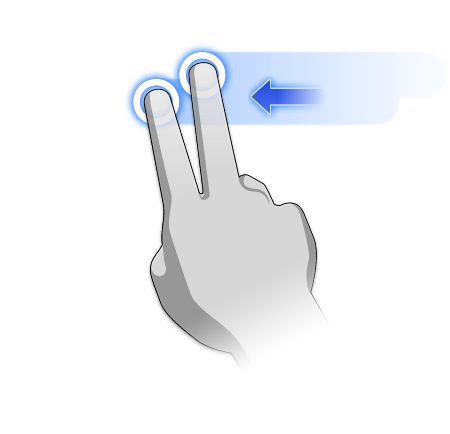
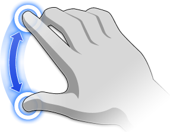
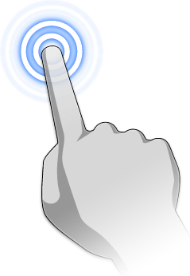
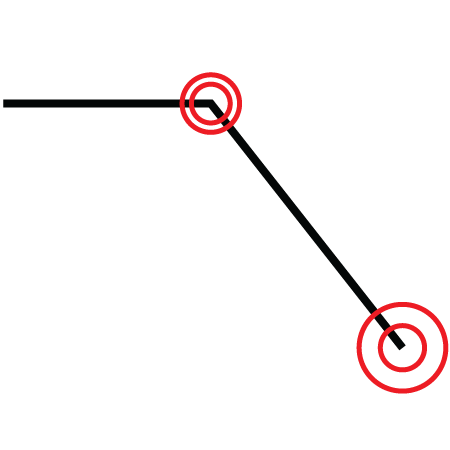
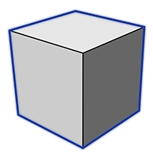

# ジェスチャ

---

ジェスチャを使用して、ユーザ インタフェースで操作します。

## ジェスチャと操作のガイド

### ビューのナビゲーション

| | | |
| ---- | ---- | ---- |
|画面移動|2 本指でドラッグ||
|オービット|1 本指でドラッグ||
|ズームインおよびズームアウト|ピンチおよびスプレッド||
|ズームして全体を表示|ダブルタップ||

### ジオメトリを作成するためのジェスチャ

| | | |
| ---- | ---- | ---- |
|2D シェイプを描画する|線分、スプライン、または長方形ツールをタップし、タップ、ドラッグ、引き上げるという一連の動作で描画||
|シェイプを押し出す|面をタップして選択し、指を上下にドラッグ||
|プリミティブを配置する|アクションバーのプリミティブをタップし、タップ、ドラッグ、引き上げるという一連の動作でオブジェクトを配置||

