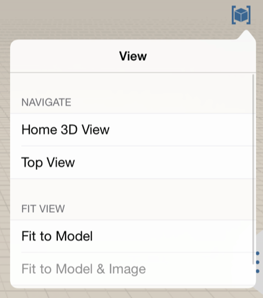
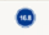

# ユーザ インタフェース ツール

---

コマンド操作ツールを紹介します。

* スケッチを保存: これをタップすると、現在のスケッチが保存され、ギャラリーに戻ります。
* 名前を設定: これをタップすると、キーボードが表示されるため、スケッチの名前を変更できます。
*  Autodesk 360 にログイン: 無償の Autodesk 360 クラウド サービスにスケッチを保存し、共有することができます。
* [ビュー設定]メニューでは、一連のプリセット ビューから選択することができます。これらのビューでは、モデルをさまざまなパースやズーム レベルですばやく表示できます。

## アクション バー

* アクション バーは画面の下部にあります。アクション バーのツールを使用すると、コンテンツを作成、編集、共有できます。

*  ジオメトリを作成: これをタップすると、形状やプリミティブを描画できる作成ツールのメニューが表示されます。
* 光源と影を変更: このツールを使用すると、日時を変更したり、日照解析を起動することができます(Pro のみ)。
*  位置を設定: 位置を検索し、衛星画像をスケッチに読み込みます。 スケッチの位置の設定方法について詳しくは、「[位置](../../Location/README.md)」を参照してください。
* エネルギー解析: 設計のエネルギー使用量を解析します。
*  イメージとモデルを読み込み: コンテンツを読み込む必要がある場合は、 このツールを使用すると、他のプログラムで作成したイメージやモデルを追加することができます。
* 作業を共有: 他ユーザと作業を共有するには、 スケッチを電子メールで送信します。また、作業対象の AXM ファイルを AirDrop 経由で近くのデバイスに共有することもできます。
* さらなるヘルプが必要な場合: FormIt 360 の詳細情報が必要な場合は、この情報ツールを使用します。

