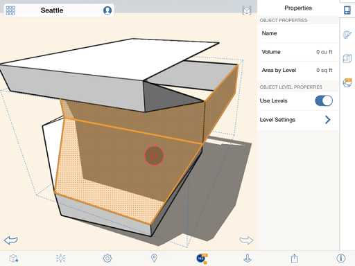
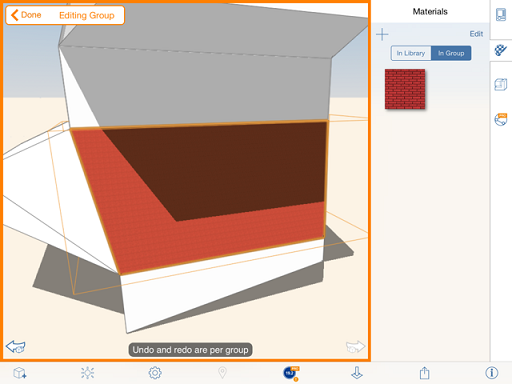

# レベルとマテリアルをグループに適用する

---

多数のオブジェクトに対して一度に適用できる方法です。

## レベルを適用する

1. グループからオブジェクトを 1 つ選択します。編集モードには切り替えないでください。
2. プロパティ パレットを開きます。
3. レベルごとに高さの値を設定するには、[レベル別の領域]をオンにして、[レベル]を選択します。

## マテリアルを適用する

1. グループを選択し、ダブルタップしてコンテキスト メニューを表示し、[編集]  をタップします。
2. グループ内の面のオブジェクトを選択します。
3. 右側のパレットを開き、[マテリアル]タブを表示します。
4. [マテリアル]をタップし、ライブラリ内のマテリアル、またはそのグループ用に既に選択されているマテリアルを使用します。

5. [完了]をタップします。

