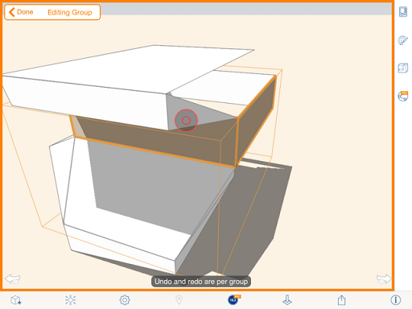

# グループを編集する

---

既存のグループを更新または変更します。

1. 編集するグループをタップします。
2. コンテキスト メニューを表示し、[グループを編集]アイコン  をタップするか、ダブルタップの動作(モード切り替えのショートカット)で編集モードに切り替えます。
3. ジオメトリを修正してグループ オブジェクトを編集します。

編集モードで[元に戻す]/[やり直し]矢印を使用すると、最後に加えた変更を削除または複製できます。編集モードを終了すると、従来どおり全図面に変更が適用され、グループには影響しなくなります。

4. 編集が完了したら、左上隅にある[完了]をタップします。

