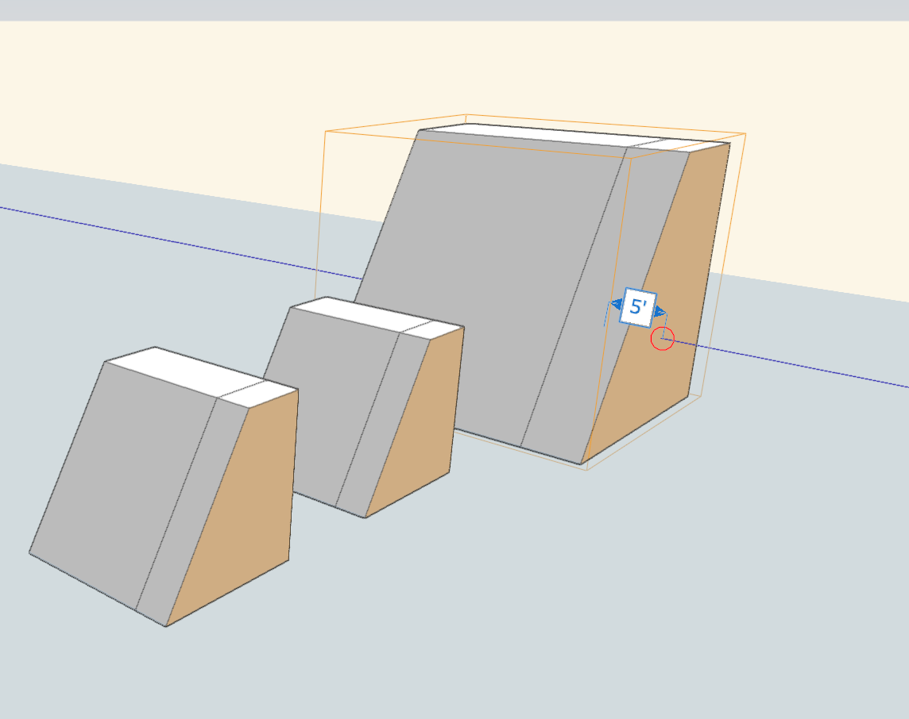

# グループを拡大/縮小する

---

他のインスタンスとの関係性を維持しながらグループ インスタンスを拡大/縮小します。

1 つのグループ インスタンスを拡大/縮小した場合、グループ内の他のインスタンスとの関係は、インスタンスのサイズを問わず維持されます。

1. グループ インスタンスを 1 つ選択します。
2. グループ インスタンスを長押ししてコンテキスト メニューを表示し、[スケール]ボタン  をタップします。
3. 拡大/縮小するグループ インスタンスをダブルタップして編集します。この編集操作は、他の小規模なグループ インスタンスにも影響することに注意してください。

