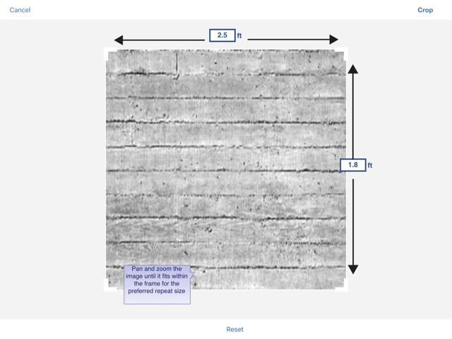
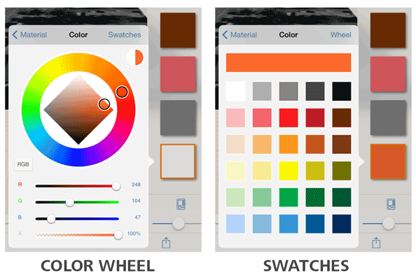

# マテリアルを作成する

---

マテリアル エディタを使用して、シーンで使用する新しいマテリアルを作成します。

カスタム ビットマップ ファイルに基づいて独自のマテリアルを作成できます。

### マテリアルを作成する

1. マテリアル パレットの[+]ボタンをタップします。
2. マテリアルに使用するビットマップを選択します。

ファイルからイメージをロードするか、タブレットで写真を撮影します。

1. マテリアルのカラーを設定します。 ビットマップがロードされた場合、カラーはそのビットマップとブレンドされます。

* カメラ ロールまたはフォト ライブラリからテクスチャが読み込まれます。読み込まれたら、[マテリアルのトリミング]ツールを使用してテクスチャのマッピングを編集できます。テクスチャをトリムして、垂直方向と水平方向のタイル スケールをメートルまたはフィート単位で定義することができます。

## オートデスク マテリアルを読み込む

オプションの [FormIt 360 Pro Subscription](http://www.autodesk.com/products/formit-360/try-buy) を購入している場合、Autodesk Materials Library からマテリアルを読み込むことができます。

1. マテリアル パレットで[マテリアルを読み込む]をタップします。
2. [マテリアルを読み込む]で、シーンに読み込むマテリアルを参照するか、名前で検索して選択し、[読み込み]をタップします。
3. マテリアルが、他のマテリアルと同様に適用または[編集](../Edit a Material.md)できるようになります。

