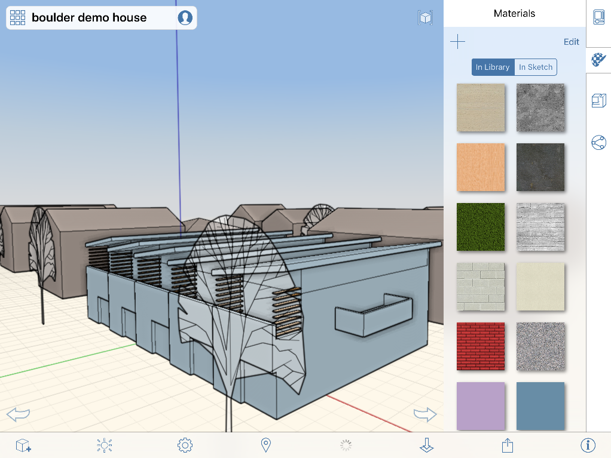

# マテリアルを使用する

---

マテリアルを使用して詳細を追加することにより、内容が充実した高度な設計を作成できます。

マテリアル エディタは右側のパレットにあります。エディタで新しいマテリアルを作成し、[マテリアル ライブラリ]に追加できます。マテリアルにカラーを追加するには、カラー ピッカーを使用してマテリアルの着色を正確に設定するか、設定済みの色見本を選択します。

マテリアル エディタにあるウィジェットでは、次の操作を行うことができます。

## マテリアルを適用する

1. マテリアルを適用するには、最初に面またはオブジェクトを選択します。
2. 画面の右側にあるタブをタップし、マテリアル エディタのアイコンをタップします。
3. 表示される選択項目からマテリアルを選択するか、独自のマテリアルを作成します。

マテリアルをスケッチに適用すると、既に使用されているマテリアルのリストに追加されるため、簡単にアクセスできるようになります。マテリアルにはテクスチャ(ビットマップ)やカラーを設定できます。マテリアルにテクスチャとカラーの両方を設定した場合は、それらがブレンドされます。

#### このセクションの内容

* [マテリアルを作成する](../Create a Material.md)

マテリアル エディタを使用して、シーンで使用する新しいマテリアルを作成します。

* [マテリアルを編集する](../Edit a Material.md)

マテリアル エディタを使用して、マテリアルを希望どおりに正確に表示します。

