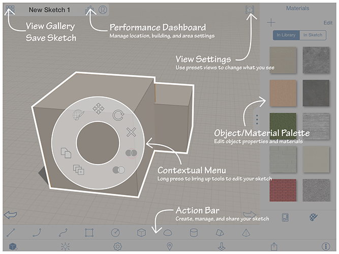

# Autodesk FormIt 360 および FormIt 360 Pro へようこそ

---

このセクションでは、BIM ワークフローを使用してコンセプト建物モデルを作成する方法について説明します。

Autodesk® FormIt® 360 を使用すると、思いついたアイデアをすぐに建築設計コンセプトとして具体化することができます。 これらのアイデアをポータブルなディジタル形式として作成し、実際の現場の情報(衛星画像など)を使用して、適切に設計を進めることができます。実際の建築データや環境データを使用して、設計のブレインストームを行ってください。予備設計を中央のデータ ストレージに保管すると、Autodesk® Revit® などのソフトウェアやアプリケーションからその予備設計にアクセスして編集できるようになります。

[ 新機能](https://www.youtube.com/playlist?list=PLqumTDi1CVHMCJkO9l3aX5vVK3GdBmxnx)

* コンテキスト メニュー

